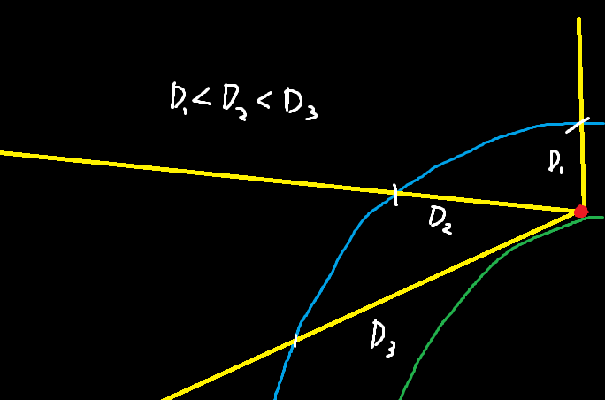

# Earth Thermal System
 A simple simulation exporing angle and intensity

From the earth's perspective, the sun revolves around the earth. Simulating its intensity at a single point and assuming the atomosphere decreases the intensity, we can assume that the angle or direction of the sun relative to the point affects the intensity value at that point.

After running the simulation from zero to zero (the tangents formed by the ray from sun to point) a parabolic pattern emerges:

There's not much of a take-away, just an interesting connection between circles and parabolas. Check the code for more clarification.